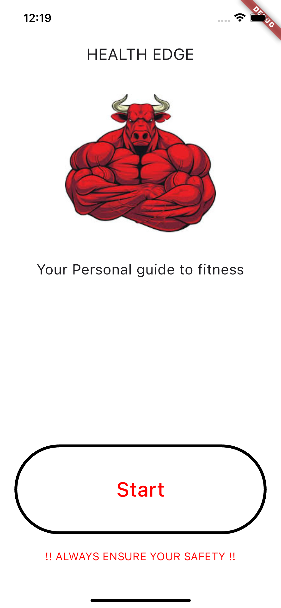
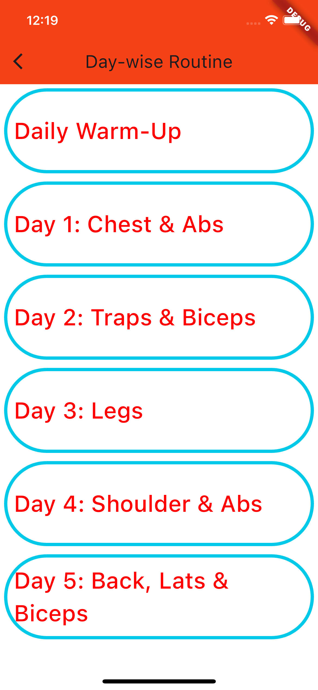
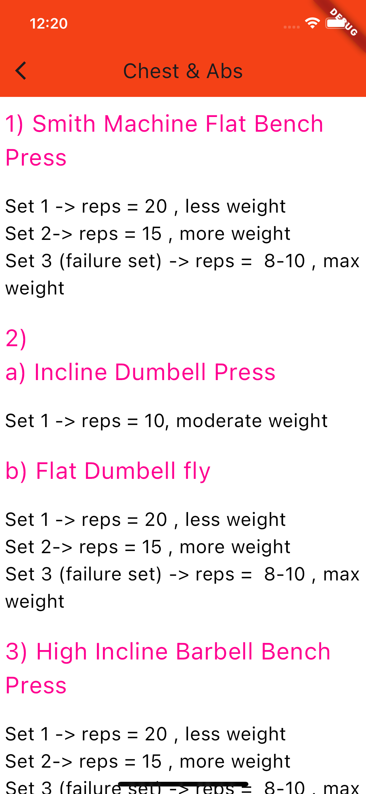

# Health Edge

Welcome to **Health Edge** - Your Personal Guide to Fitness!

## Overview

Health Edge is a mobile application built with Flutter that serves as your companion on your fitness journey. It provides a 5-Day Gym Routine designed for beginners and adaptable for all body types. The application is your gateway to a healthier lifestyle.

## Features

- **Day-wise Routine:** Explore a structured 5-day workout plan targeting different muscle groups.
- **Daily Warm-Up:** Begin your fitness journey with a dedicated daily warm-up routine.
- **Guided Workouts:** Each day's workout is tailored to specific muscle groups for a well-rounded fitness experience.

## Getting Started

To run the application, follow these steps:

1. Ensure you have Flutter and Dart installed on your development environment.
2. Clone this repository.
3. Open the project in your preferred IDE.
4. Run the application using the `flutter run` command.

## Screenshots

*Home Page*

*Daywise Routine Page*

*Chest Workout*

## Usage

1. **Launch the App:**
   Open the application on your device.

2. **Explore Day-wise Routine:**
   Navigate through the day-wise routine to discover targeted workouts.

3. **Get Started:**
   Click on the "Start" button to kickstart your fitness journey.

4. **Safety First:**
   Always prioritize your safety during workouts.

## Contributing

If you'd like to contribute to the project, please follow these steps:

1. Fork the repository.
2. Create a new branch for your feature or bug fix.
3. Make your changes and submit a pull request.

## Credits

- [Flutter](https://flutter.dev/) - UI toolkit for building natively compiled applications.
- [Material Design](https://material.io/design) - Design system by Google for a consistent look and feel.

## License

This project is licensed under the [MIT License](LICENSE).

---